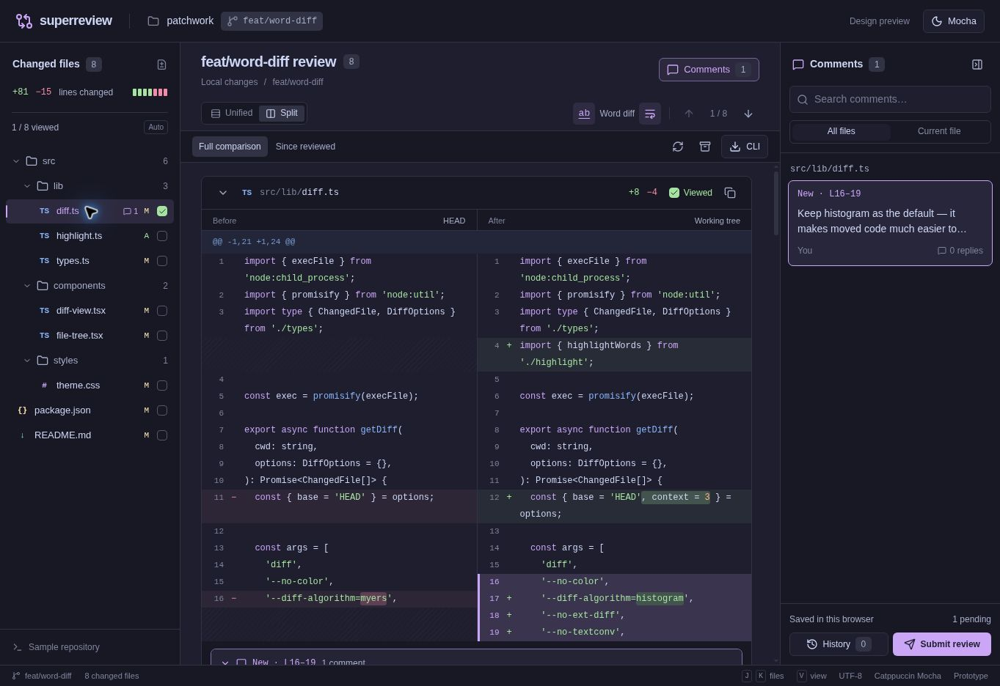

# Superreview

Superreview is a local code review tool for Git. Open changes in your browser, leave comments, and share feedback with your coding agent or teammates. Track what you’ve reviewed as the code changes, without losing earlier feedback.

[](docs/images/superreview-desktop.jpg)

## Quick start

After [installing Superreview](#installation), run it inside the Git repository you want to review:

```sh
superreview                 # Review staged, unstaged, and untracked changes
superreview main...HEAD     # Review your branch against main
```

Superreview opens in your browser:

1. Browse changes in unified or split view.
2. Add line comments or select a range to comment on. Files are marked viewed as you read them, or you can mark them manually.
3. Submit a feedback round and choose **Copy as Markdown** to share it.
4. After more edits, refresh and use **Since reviewed** to focus on remaining changes.

Keep the terminal running while reviewing. Press Ctrl+C when you’re done. Your review stays saved.

## Installation

**Not published to npm yet. Coming soon.** For now, install from a source checkout.

You’ll need Node.js 22.13 or newer, Git, and pnpm. From the Superreview checkout:

```sh
pnpm install --frozen-lockfile
pnpm link:global
```

Then switch to the repository you want to review and run `superreview`.

The installed command follows this checkout. Run `pnpm build` after updating the source.

## Common workflows

### Review your agent’s work

Run `superreview` after your agent makes changes. Leave comments, submit a round, and copy the feedback as Markdown for your agent. After it addresses your feedback, refresh the review. Unchanged files retain their viewed state, and **Since reviewed** helps you focus on what still needs attention.

### Review a teammate’s branch

Fetch and check out the branch using Git, then compare it against the target branch:

```sh
superreview main...HEAD
```

Review, comment, and submit a round. Copy the feedback from the submission dialog or **History** to share it. After new commits arrive, run the same command again to update the review.

### Return to a saved review

```sh
superreview list
superreview open <id>
```

Opening a saved review restores its captured changes, even if the branch has changed or disappeared. Use **Refresh** to capture the current code.

See the [CLI guide](docs/CLI.md) for more comparisons, path filters, exports, and review management commands.

## Local and private

- Your code and review history stay on your machine. No remote service receives your code.
- Reviews are saved in `.superreview/` inside your repository, automatically excluded from Git locally.
- Earlier submissions preserve the feedback and code context from that round. Later edits do not rewrite them.
- GitHub/GitLab fetching and publishing are not supported yet. Check out branches with Git and share feedback manually.

## Coding agent integration

You can install the optional Superreview skill to help your coding agent work with reviews:

```sh
npx skills add git@github.com:tobias-walle/superreview.git --skill superreview
```

Choose your agent harness in the installer. The skill does not install the Superreview command itself.

See [agent skill setup](docs/CLI.md#agent-skill) for details.

## Credits and licenses

Word-level highlighting is based on [delta’s](https://github.com/dandavison/delta) alignment algorithm. See [third-party notices](THIRD_PARTY_NOTICES.md) for licenses.

## Development

From the source checkout:

```sh
pnpm install --frozen-lockfile
pnpm dev                 # Build and launch against the current worktree
pnpm dev --help          # Show CLI options
pnpm build              # Build the standalone CLI
pnpm check              # Run the cached full check suite
```

Pass CLI options directly, for example `pnpm dev --no-open main...HEAD`.

- [CLI workflows and local storage](docs/CLI.md)
- [Architecture and extension boundaries](docs/ARCHITECTURE.md)
- [Release verification](docs/TESTING.md)
